<h2>Architecture Micro-services</h2>

<h3>Objectif</h3>
L'objectif de cette activité est de créer una pplication basée sur une architecture micro-service permettant de gérer les factures contenat des produits et appartenat à un client.
 
<h3> L'architecture</h3>
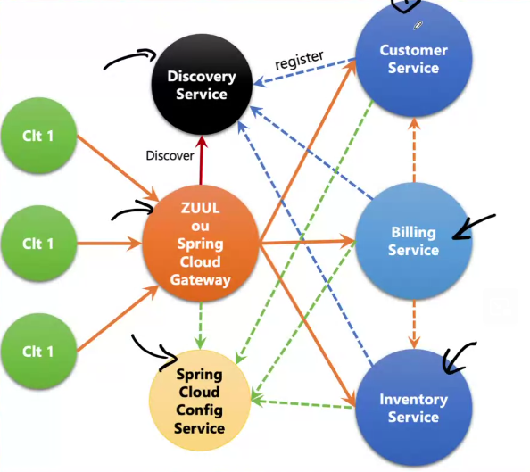
 
<ol>
<li>Création du micro-service "customer-service "</li>
Le micro-service "customer-service" permettra de gérer les clients.
 
<h3>Structure du projet</h3>
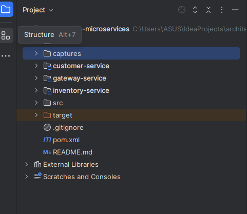
 
 
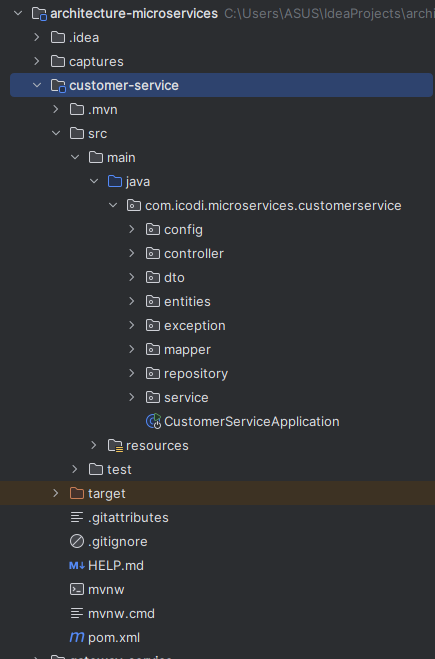
 
 
<ul>
<li>Dépendance du micro-service : "customer-service"</li>
 
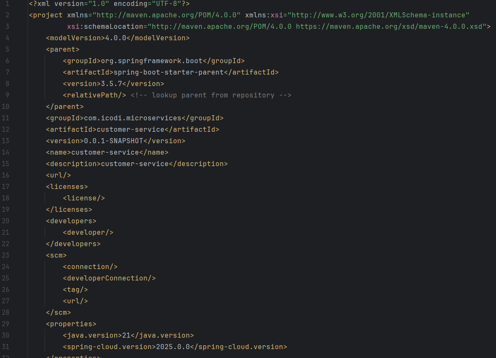
 
 
<li>Entité - Customer.java</li>
 
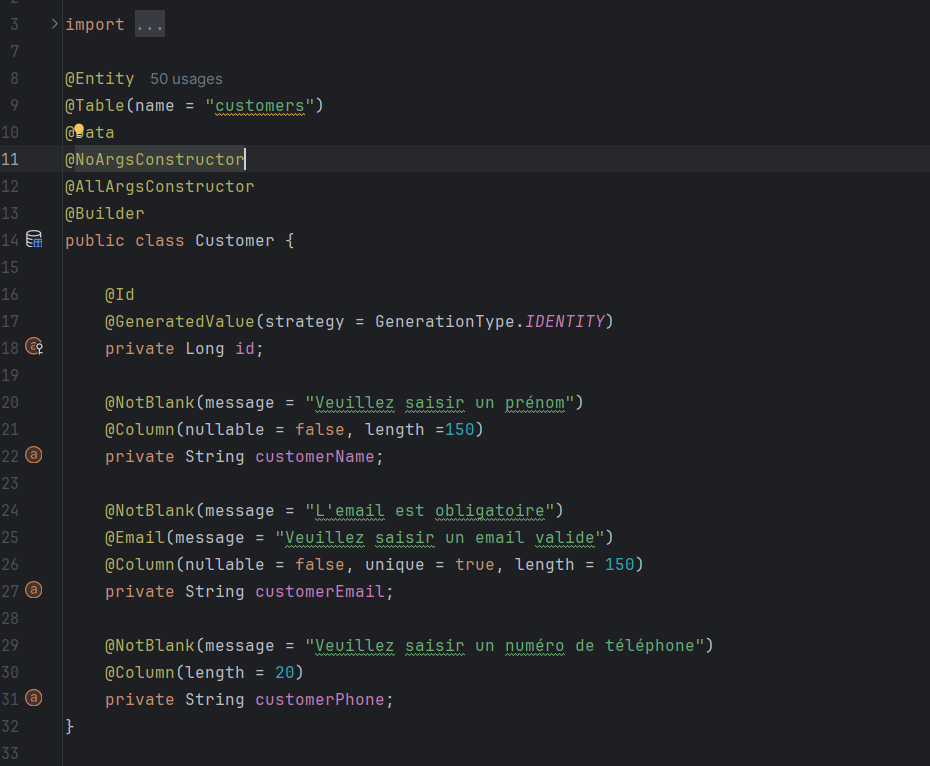
 
 
<li>DTO - CustomerDTO.java</li>
 

 
 
<li>Repository - CustomerRepository.java</li>
 
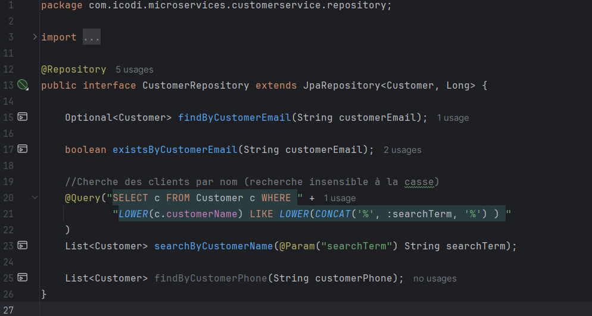
 
 
<li>Mapper - CustomerMapper.java</li>
 
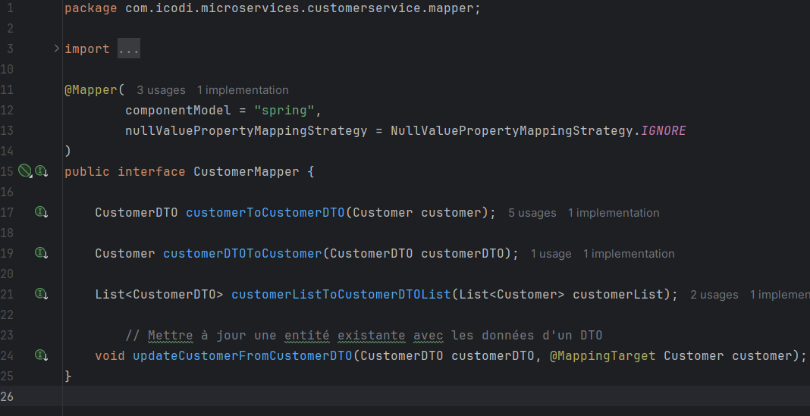
 
 
<li>Controller - CustomerController.java</li>
 
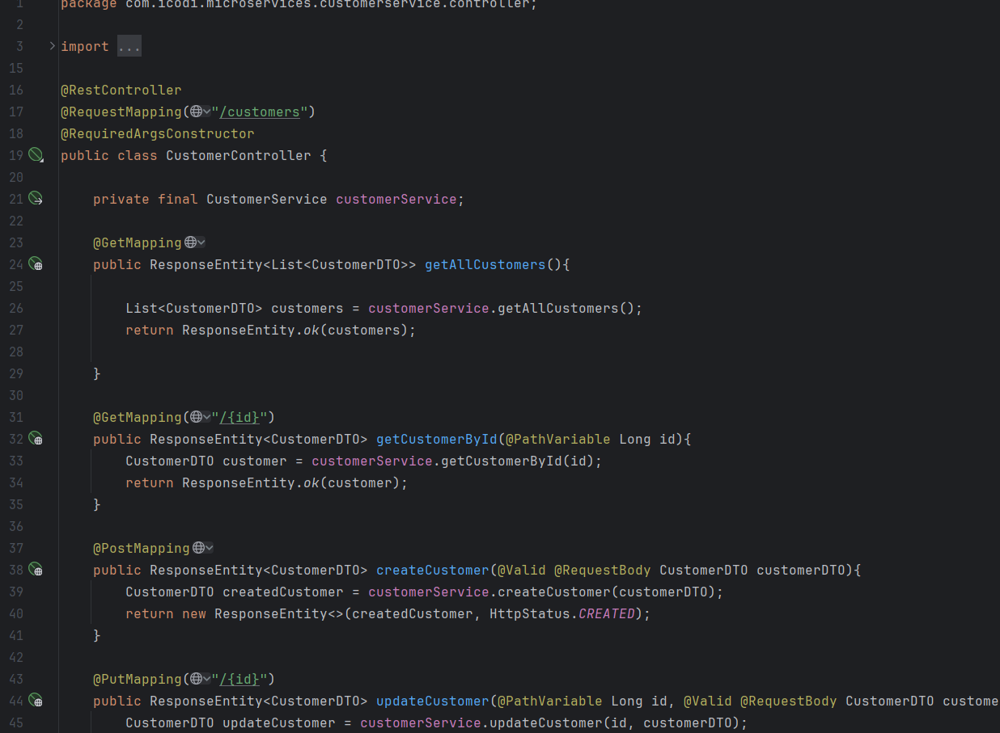
 
 
<li>Service - CustomerService.java</li>
 
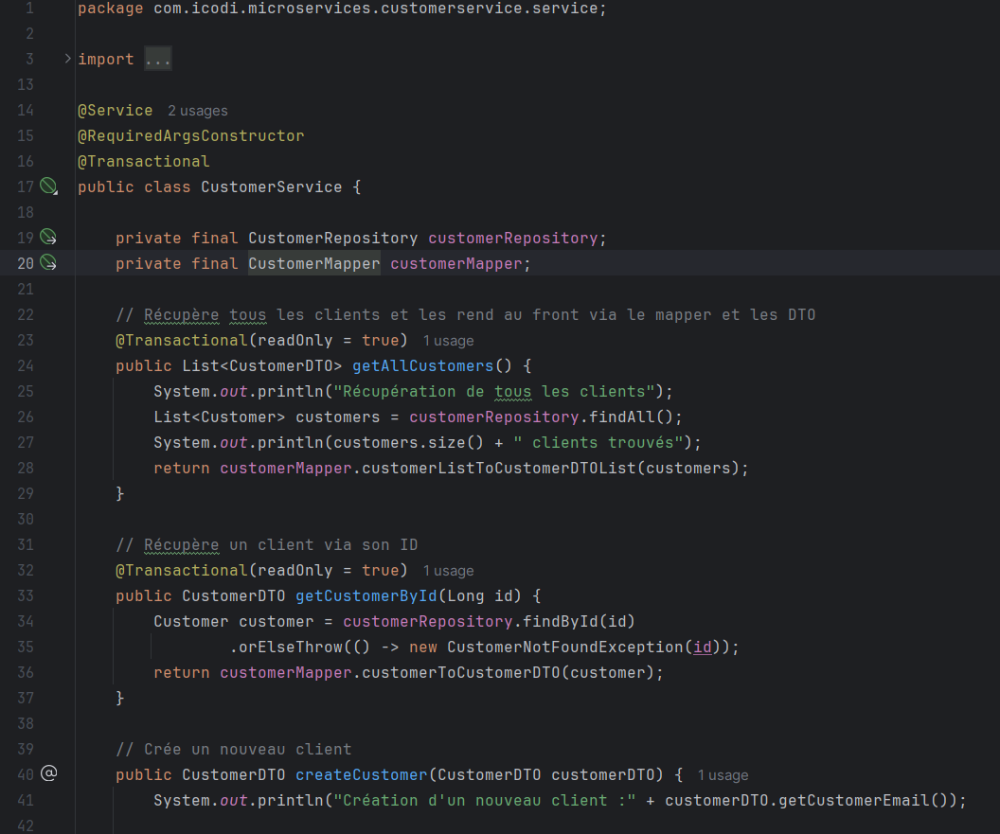
 
 
<li>Configuration - application.yml</li>
 
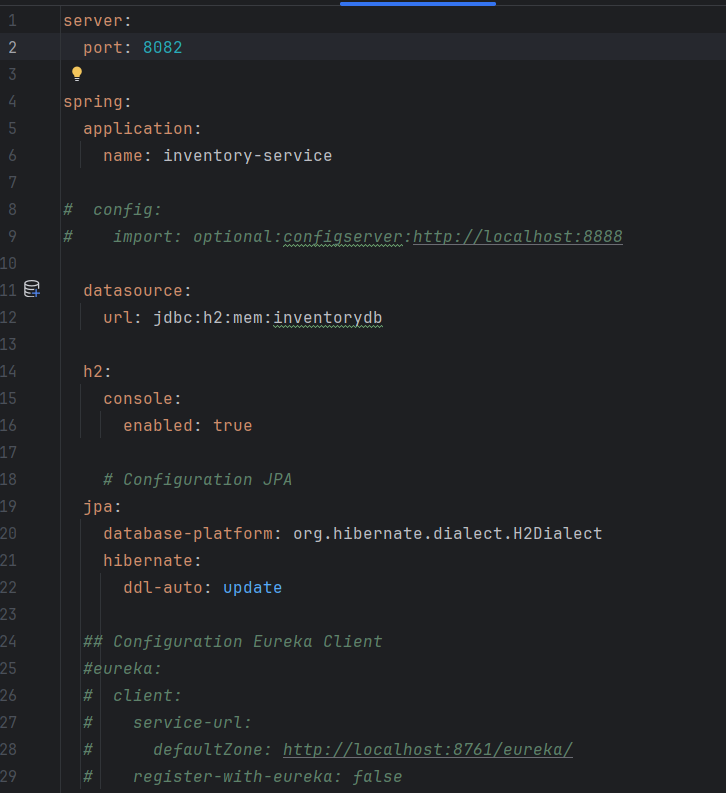
 
 
<li>Main - CustomerServiceApplication.java</li>
 
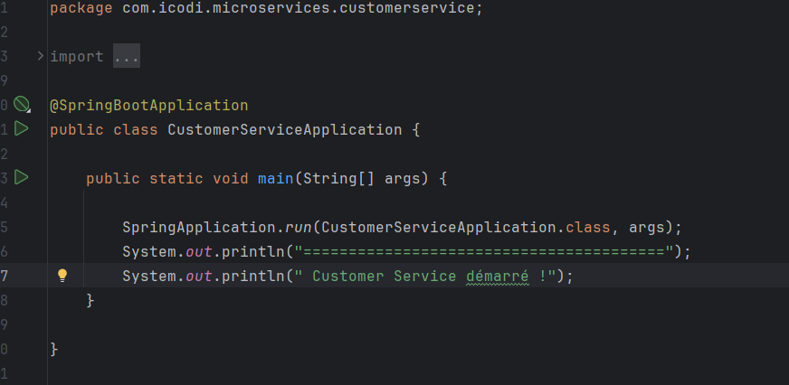
 
 
<li>Tests des endpoints</li>
 

 
 
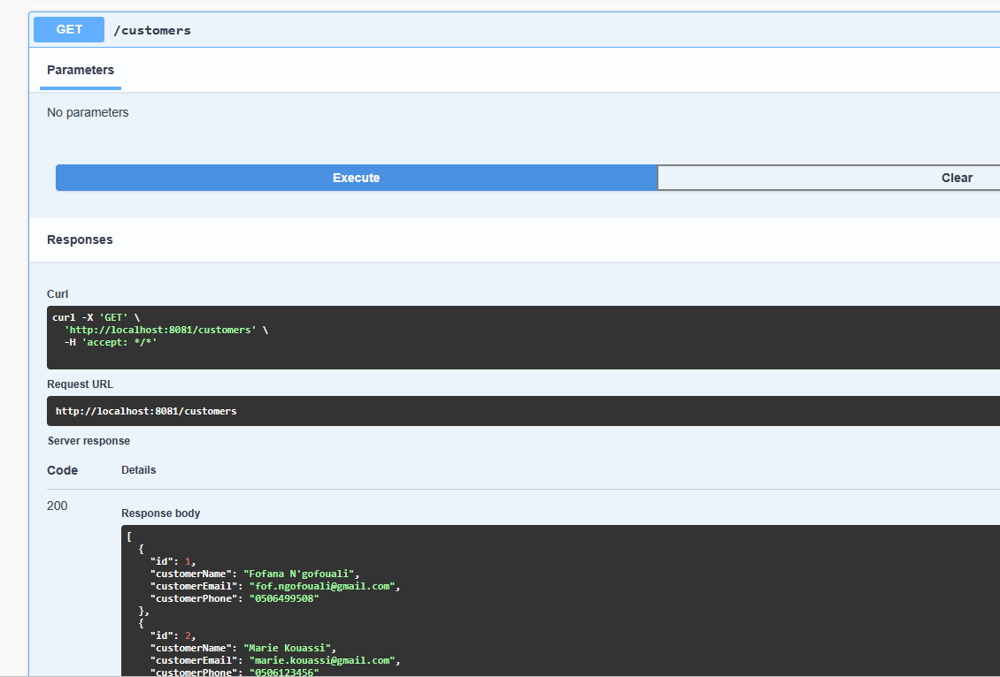
</ul>
</ol>
